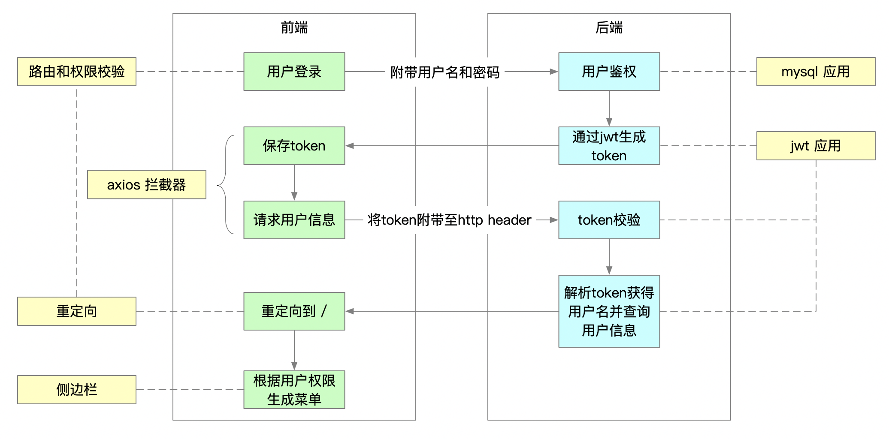
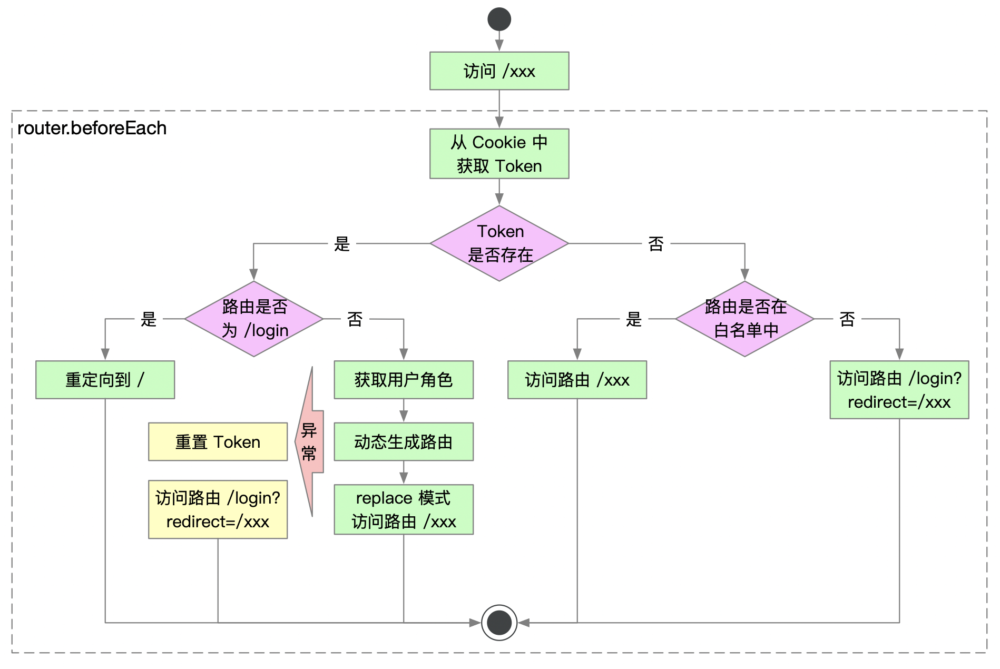

# 1、登录流程








### 1.1、分析

##### 1.1.1、登录login组件

```js
点击登录时，执行了vuex的user/login
/**
*title:api/user.js
*desc:点击登录的时候执行的函数，如果登录时地址栏login?redirect=/book/create,登录后就跳到路由/book/create，如果?后面没有，就跳到/首页，待定。
*/

 handleLogin() {
      this.$refs.loginForm.validate(valid => {
        if (valid) {
          this.loading = true
          this.$store.dispatch('user/login', this.loginForm)
            .then(() => {
              this.$router.push({ path: this.redirect || '/', query: this.otherQuery })
              this.loading = false
            })
            .catch(() => {
              this.loading = false
            })
        } else {
          console.log('error submit!!')
          return false
        }
      })
    }

/**
*title:store/modules/user.js/login
*desc:发送请求得到token,并保存在vuex和cookie里面
*/

const actions = {
  // user login
  login({ commit }, userInfo) {
    const { username, password } = userInfo
    return new Promise((resolve, reject) => {
        //这个login在api/user.js里面，主要是发送请求
      login({ username: username.trim(), password: password }).then(response => {
        const { data } = response 
        commit('SET_TOKEN', data.token) //token保留在vuex/user.js/state(token)
        setToken(data.token) //保存在cookie里，键名为Admin-Token
        resolve()
      }).catch(error => {
        reject(error)
      })
    })
  },
    
/**
*title:api/user.js
*desc:主要发送ajax请求。
*/
  export function login(data) {
  return request({
    url: '/user/login',
    method: 'post',
    data
  })
}
```

##### 1.1.2、logout登出

```js
/**
*title:layout/components/navbar.vue 
*desc:点击log out逻辑
*/
async logout() {
      await this.$store.dispatch('user/logout')
      this.$router.push(`/login?redirect=${this.$route.fullPath}`)
    }

/**
*title:store/modules/user.js
*desc:this.$store.dispatch('user/logout')的逻辑
*/
  // user logout
  logout({ commit, state, dispatch }) {
    return new Promise((resolve, reject) => {
      logout(state.token).then(() => {
        commit('SET_TOKEN', '')
        commit('SET_ROLES', [])
        removeToken() //cookie
        resetRouter()

        // reset visited views and cached views
        // to fixed https://github.com/PanJiaChen/vue-element-admin/issues/2485
        dispatch('tagsView/delAllViews', null, { root: true })

        resolve()
      }).catch(error => {
        reject(error)
      })
    })
  },
```


```
模板
/**
*title:api/user.js
*desc:
*/
```